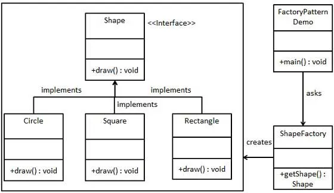

<p align="center">
  <a href="https://github.com/txt/se25fall/blob/main/README.md#top"></a>
  <a href="/docs/syllabus.md#top"></a>
  <a href="https://docs.google.com/spreadsheets/d/1E7H6IiFEV0WIooE1biPB7VVrdaEtBh6yXC-2nrwPKCY/edit?gid=0#gid=0"></a>
  <a href="https://docs.google.com/spreadsheets/d/1i0fNqKea0LzqmB-h8gtOrnF0MM-qt560goU4QkRw8BA/edit?usp=sharing"></a>
  <a href="https://moodle-courses2527.wolfware.ncsu.edu/course/view.php?id=4690&bp=s"></a>
  <a href="https://moodle-courses2527.wolfware.ncsu.edu/course/view.php?id=4691&bp=s"></a>
  <a href="https://discord.gg/YnAw7uZxAD"></a>
  <a href="https://ncsu.hosted.panopto.com/Panopto/Pages/Sessions/List.aspx?folderID=7b1bbb56-937c-42a1-96b4-b33e0134710f"></a>
  <a href="/LICENSE.md"></a></p>
<h1 align="center">:cyclone: CSC510: Software Engineering<br>
NC State, Fall '25</h1>


<h1 align="center">🔄 Closures & Functional Thinking<br>
The Theory Under the Hood</h1>

> *"There's nothing more practical than a good theory."* — Kurt Lewin

> *"Everything you know about objects is just a tiny corner of 
> closures."* — This lecture


## 🎯 The Big Reveal

**You've been using closures all along.** Every time you write a 
Python function, every callback, every lambda — closures. They're the 
computational foundation that makes everything work.

**Today's agenda:**
1. **First-class functions** — functions as variables
2. **Closures** — functions that remember their environment
3. **Why OOP is just syntactic sugar** — the uncomfortable truth
4. **Design patterns = functional patterns** — they're the same thing

## 📋 Patterns Primer (60 Second Refresher)

**Design patterns are proven solutions to common problems.** 

```
Design Patterns (23 total)
    │
    ├─ Creational (5) ─── How to make objects
    │   ├─ Factory
    │   ├─ Singleton
    │   ├─ Builder
    │   ├─ Prototype
    │   └─ Abstract Factory
    │
    ├─ Structural (7) ─── How to compose objects
    │   ├─ Adapter
    │   ├─ Decorator
    │   ├─ Facade
    │   ├─ Proxy
    │   └─ ...
    │
    └─ Behavioral (11) ── How objects interact
        ├─ Strategy
        ├─ Observer
        ├─ Template Method
        ├─ Visitor
        └─ ...
```
Each pattern is a tiny object  model:



**Creational** — how to make objects
- **Factory:** Method that returns objects
- **Singleton:** Only one instance allowed

**Structural** — how to compose objects
- **Adapter:** Make incompatible interfaces work together
- **Decorator:** Add behavior without modifying class

**Behavioral** — how objects interact
- **Strategy:** Pass algorithm as parameter
- **Observer:** Objects subscribe to events
- **Template Method:** Define skeleton, subclass fills in steps
- **Visitor:** Add operations to objects without modifying them

**The impact was massive.** Spring framework is built on patterns. 
Enterprise Java is patterns everywhere. Entire careers built on 
knowing the 23 Gang of Four patterns. Job interviews tested pattern 
knowledge. Patterns shaped how we think about software architecture 
for decades.

**Today's revelation:** Most of these are just ways to pass functions 
around. The functional version is usually simpler.


## 🎨 Part 1: First-Class Functions

**Definition:** In a language with first-class functions, functions 
are values. You can pass them around like integers or strings.

### Python Already Does This

```python
# Functions are values
def add(x, y):
    return x + y

def multiply(x, y):
    return x * y

# Store function in variable
operation = add
print(operation(3, 4))  # 7

# Change behavior without changing call site
operation = multiply
print(operation(3, 4))  # 12
```

**Why it matters:** This is the **Open-Closed Principle** in action. 
The calling code doesn't change, but behavior does.

---

### The Power: Higher-Order Functions

**Higher-order function:** Takes a function as input or returns one as 
output.

```python
# ❌ BAD: Hard-coded sorting
def sort_by_length(words):
    # Logic specific to length sorting
    ...

def sort_alphabetically(words):
    # Logic specific to alphabetical sorting
    ...

# ✅ GOOD: One sort, many behaviors
words = ["alice", "bob", "alexandra", "zoe"]

# Sort by length
words.sort(key=lambda w: len(w))
# ['bob', 'zoe', 'alice', 'alexandra']

# Sort alphabetically
words.sort(key=lambda w: w)
# ['alexandra', 'alice', 'bob', 'zoe']

# Sort by last letter
words.sort(key=lambda w: w[-1])
# ['alexandra', 'alice', 'bob', 'zoe']
```

**The `sort` function is closed** (you didn't modify it) but **open** 
(you extended its behavior).


### Pattern Recognition: Strategy Pattern

**Remember the Strategy pattern?** It's pass an algorithm around a collection of isntances; i.e. it is passing a function. E.g. pass "print" to all parts in an assembly.

```python
# Strategy Pattern - The OOP Way
class SortStrategy:
    def compare(self, a, b): pass

class LengthSort(SortStrategy):
    def compare(self, a, b):
        return len(a) - len(b)

sorter = Sorter(LengthSort())
sorter.sort(words)

# Functional Way - Already built into Python
words.sort(key=len)
```

**Takeaway:** Strategy pattern = passing a function. 

## 🔐 Part 2: Closures (The Secret Sauce)

**Definition:** A closure is a function bundled together with 
references to its surrounding state (the lexical environment).

**Translation:** A function that "remembers" variables from where it 
was created.

### Example 1: Counter

```python
def make_counter():
    count = 0  # This variable is "closed over"
    
    def increment():
        nonlocal count
        count += 1
        return count
    
    return increment

# Create two independent counters
counter1 = make_counter()
counter2 = make_counter()

print(counter1())  # 1
print(counter1())  # 2
print(counter2())  # 1  ← Different count!
print(counter1())  # 3
```

**What happened?** Each call to `make_counter()` creates a new `count` 
variable. The returned `increment` function remembers *its* `count`.

**Key insight:** The `count` variable lives as long as `increment` 
exists, even though `make_counter()` returned.


### Example 2: Customizable Multiplier

```python
def make_multiplier(factor):
    def multiply(x):
        return x * factor  # factor is remembered
    return multiply

times_two = make_multiplier(2)
times_ten = make_multiplier(10)

print(times_two(5))   # 10
print(times_ten(5))   # 50
```

**This is the Template Method pattern** — same structure, different 
behavior.


### Example 3: Event Callbacks (The Killer App)

```python
def setup_button(button_id, message):
    def on_click():
        print(f"Button {button_id}: {message}")
    
    # Register the callback
    register_callback(button_id, on_click)

setup_button("btn1", "Hello")
setup_button("btn2", "Goodbye")

# When user clicks:
# Button btn1: Hello
# Button btn2: Goodbye
```

**Why closures matter here:** Each callback remembers *its* 
`button_id` and `message`. No global variables needed.


## 🏗️ Part 3: The   Truth About OOP

**Claim:** Objects are just closures with pretty  syntax.

**Proof by example:**

```python
# Object-Oriented Version
class BankAccount:
    def __init__(self, balance):
        self._balance = balance
    
    def deposit(self, amount):
        self._balance += amount
    
    def get_balance(self):
        return self._balance

account = BankAccount(100)
account.deposit(50)
print(account.get_balance())  # 150
```

```python
# Closure Version
def make_account(balance):
    def deposit(amount):
        nonlocal balance
        balance += amount
    
    def get_balance():
        return balance
    
    return {'deposit': deposit, 'get_balance': get_balance}

account = make_account(100)
account['deposit'](50)
print(account['get_balance']())  # 150
```

**They're the same thing.** The class version is syntactic sugar for 
the closure version.


### What's Really Happening in OOP

When you write:
```python
class Employee:
    def __init__(self, name, salary):
        self.name = name
        self.salary = salary
    
    def give_raise(self, amount):
        self.salary += amount
```

**Python internally:**
1. Creates a closure containing `name` and `salary`
2. Stores methods as functions in the class
3. When you call `emp.give_raise(1000)`, it's really calling 
   `Employee.give_raise(emp, 1000)`

**The `self` parameter is the closure being passed explicitly.**


### Why This Matters

**Implications:**
1. **OOP is one pattern among many** — not the only way to structure 
   code
2. **Closures are more fundamental** — they existed first (Lisp, 1958)
3. **Modern languages trend functional** — Rust, Swift, Kotlin all 
   emphasize functions over objects
4. **You already know functional programming** — you just didn't know 
   the name


## 🎭 Part 4: Patterns Are Functions

**Most Gang of Four patterns are just function manipulation.**

### Observer Pattern = Callbacks

```python
# Observer Pattern - The OOP Way
class Subject:
    def __init__(self):
        self._observers = []
    
    def attach(self, observer):
        self._observers.append(observer)
    
    def notify(self, data):
        for obs in self._observers:
            obs.update(data)

class Observer:
    def update(self, data): pass

# Functional Way - Just a list of functions
observers = []

def notify(data):
    for callback in observers:
        callback(data)

# Register callbacks
observers.append(lambda x: print(f"Got {x}"))
observers.append(lambda x: log(x))

notify("event")
```

**The functional version is simpler.** No interfaces, no classes.


### Template Method = Higher-Order Function

```python
# Template Method - OOP Way
class DataProcessor:
    def process(self, data):
        self.read(data)
        self.transform(data)  # Subclass overrides this
        self.write(data)
    
    def transform(self, data):
        pass  # Abstract

class UpperCaseProcessor(DataProcessor):
    def transform(self, data):
        return data.upper()

# Functional Way
def process(data, transform_fn):
    data = read(data)
    data = transform_fn(data)  # Pass behavior as function
    write(data)

process(data, lambda x: x.upper())
process(data, lambda x: x.lower())
```

---

### Visitor Pattern = Function Dispatch

```python
# Visitor Pattern - OOP Way (complex)
class Visitor:
    def visit_clothing(self, item): pass
    def visit_electronics(self, item): pass

class TaxVisitor(Visitor):
    def visit_clothing(self, item):
        return item.price * 0.08
    
    def visit_electronics(self, item):
        return item.price * 0.12

# Functional Way - Just a dictionary of functions
def tax_calculator(item):
    tax_rates = {
        'clothing': 0.08,
        'electronics': 0.12,
        'food': 0.0
    }
    return item.price * tax_rates[item.type]
```

**Pattern:** Dictionary of functions is often cleaner than visitor 
hierarchy.


## 🧮 Part 5: Recursion & Immutability

**Pure functional languages** (Haskell, Clojure) forbid changing 
variables. How do you count?

```python
# Imperative (mutable)
count = 0
for item in items:
    count += 1

# Functional (immutable)
def count_items(items, total=0):
    if not items:
        return total
    return count_items(items[1:], total + 1)

# Python's functional way
len(items)  # Built-in recursion
```

**Why immutability matters:**
- No race conditions (thread-safe by default)
- Easier to reason about (no spooky action at a distance)
- Enables compiler optimizations


### Tail Call Optimization

**Problem:** Python's recursion limit is ~1000 calls (in the documentation) but ~50 (pragmatically).
```python
def factorial(n):
    if n <= 1:
        return 1
    return n * factorial(n - 1)

factorial(2000)  # RecursionError!
```

**Solution in functional languages:** Tail call optimization. If the 
last thing a function does is call itself, reuse the stack frame.

```python
# Tail-recursive version (Python still hits limit, but shows concept)
def factorial(n, accumulator=1):
    if n <= 1:
        return accumulator
    return factorial(n - 1, n * accumulator)  # Tail call
```

**In Haskell/Lisp:** This runs forever without stack overflow. Python 
doesn't optimize this (yet).


## 🌊 Part 6: Python's Functional Features

**You've been doing functional programming already:**

### List Comprehensions = Map + Filter

```python
# Imperative
results = []
for x in numbers:
    if x % 2 == 0:
        results.append(x * 2)

# Functional
results = [x * 2 for x in numbers if x % 2 == 0]

# More explicitly functional
results = map(lambda x: x * 2, filter(lambda x: x % 2 == 0, numbers))
```


### Generators = Lazy Evaluation

```python
# Returns all at once (memory hungry)
def get_numbers(n):
    return [i for i in range(n)]

# Returns one at a time (memory efficient)
def get_numbers(n):
    for i in range(n):
        yield i

# Usage is identical
for num in get_numbers(1000000):
    print(num)  # Only one number in memory at a time
```

**Generators are closures** — they remember their state between 
yields.


### The `functools` Module

```python
from functools import reduce

# reduce: Apply function cumulatively
numbers = [1, 2, 3, 4, 5]
total = reduce(lambda acc, x: acc + x, numbers)  # 15

# partial: Pre-fill arguments
from functools import partial

def multiply(x, y):
    return x * y

double = partial(multiply, 2)
print(double(5))  # 10
```


## 🔬 Part 7: Why Functional Programming Now?

**Historical:** FP was too slow (recursion, immutability overhead).

**Modern reality:**
1. **Concurrency is everywhere** — multi-core CPUs, distributed 
   systems
2. **Immutability prevents bugs** — no race conditions, easier testing
3. **Compilers got smart** — tail call optimization, escape analysis
4. **Cloud computing** — stateless functions scale horizontally
5. **AI/ML pipelines** — data transformations compose naturally

**Languages trending functional:**
- **Rust:** Immutability by default
- **Swift:** Optionals, map/filter/reduce
- **Kotlin:** Functional + OOP hybrid
- **JavaScript:** Arrow functions, promises, React hooks


## 📊 Part 8: When NOT to Use Functional Style

**Use mutation when:**
1. **Performance critical** — game loops, real-time systems
2. **Inherently stateful** — UI state, database connections
3. **Team prefers OOP** — consistency matters more than paradigm purity

**Python philosophy:** Multi-paradigm. Use the best tool for the job.

```python
# Good use of mutation
class GameState:
    def __init__(self):
        self.score = 0
        self.lives = 3
    
    def hit(self):
        self.lives -= 1  # Mutation makes sense here

# Good use of functions
def calculate_damage(attacker, defender):
    # Pure function - no side effects
    return attacker.strength - defender.armor
```


## 🎬 Part 9: The Lambda Calculus Connection

**The theory:** Alonzo Church's lambda calculus (1930s) proved that 
only three things are needed for universal computation:
1. Variables
2. Function abstraction (λx. expression)
3. Function application

**Everything else is syntactic sugar.**

**Practical impact:**
- JavaScript was built on lambda calculus (Brendan Eich, 1995)
- Enables building languages in ~100 lines of code
- Peter Norvig's [Lispy](http://norvig.com/lispy.html): Full Lisp 
  interpreter in 32 lines of Python

**The lesson:** Simple, elegant theory enables powerful practice.


## 🎓 Part 10: Practical Takeaways

**What you already knew (but now have names for):**
- ✅ Passing functions to `sort()` → first-class functions
- ✅ Lambda expressions → anonymous functions
- ✅ List comprehensions → map/filter composition
- ✅ Callback functions → closures capturing context

**What to do differently:**
1. **Prefer functions over classes** for simple stateless operations
2. **Use closures** instead of global variables
3. **Think in transformations** (input → output) not mutations
4. **Recognize patterns as functions** (Strategy = parameter, 
   Observer = callbacks)

**The big picture:** You're not learning a new paradigm. You're 
recognizing that what you've been doing all along has deep theoretical 
foundations.


## 🚀 Part 11: Try This

**Exercise 1: Rewrite a class as closures**
```python
# Your task: Convert this class to pure functions + closures
class ShoppingCart:
    def __init__(self):
        self.items = []
    
    def add(self, item):
        self.items.append(item)
    
    def total(self):
        return sum(item.price for item in self.items)
```

**Exercise 2: Replace if-else chains with dictionaries**
```python
# Ugly
def calculate_discount(customer_type):
    if customer_type == "regular":
        return 0.0
    elif customer_type == "member":
        return 0.1
    elif customer_type == "vip":
        return 0.2

# Better: Dictionary of functions
discounts = {
    'regular': lambda: 0.0,
    'member': lambda: 0.1,
    'vip': lambda: 0.2
}

def calculate_discount(customer_type):
    return discounts[customer_type]()
```


## 📚 References

1. Abelson & Sussman. *Structure and Interpretation of Computer 
   Programs*. 1985.
2. Norvig, Peter. "[Lispy](http://norvig.com/lispy.html)." 2010.
3. McCarthy, John. "Recursive Functions of Symbolic Expressions." 
   1960.
4. Graham, Paul. "The Roots of Lisp." 2001.
5. Hughes, John. "Why Functional Programming Matters." 1990.

**Historical note:** The first Lisp interpreter was written by Steve 
Russell in 1960 after John McCarthy described the theory. McCarthy 
told him, "You're confusing theory with practice." Russell did it 
anyway. (All grad students should ignore their supervisors 
occasionally.)
